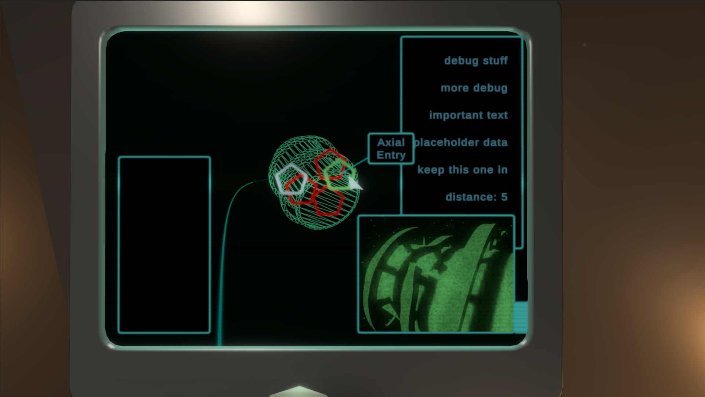
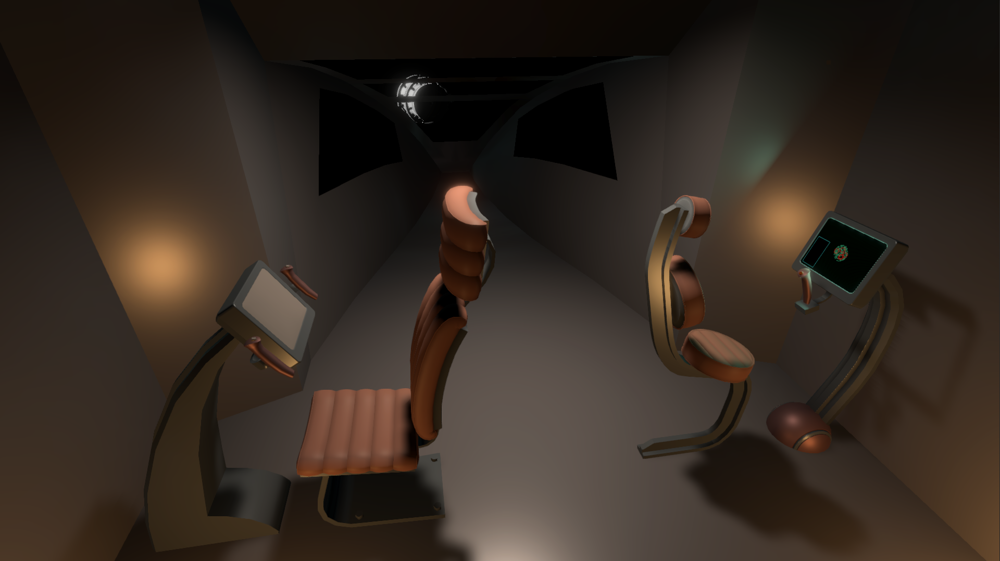

# Untitled Space Derelict Exploration Experiment
### As a space archeologist, operate science drones to explore long-lost relics of humanity's early days of interstellar travel

- The player is constrained to the cockpit and living areas of their science vessel, and explores the space relics by interacting with various terminals to launch and pilot drones
- Emphasis on working with shoddy equipment, dealing with spotty signal quality and working around breakdowns and equipment failure

Unity 2020.1.11f1

## Screenshots

